<div align="center">

# 🧠 mental-health-nlp-ptbr

**Detecção Longitudinal de Sinais de Depressão e Ideação Suicida em Redes Sociais com Transformers e Modelos de Linguagem**

[](https://github.com/luanfreitas5/mental-health-nlp-ptbr/actions/workflows/ci.yml)
[](https://github.com/luanfreitas5/mental-health-nlp-ptbr/actions/workflows/tests.yml)
[](https://luanfreitas5.github.io/mental-health-nlp-ptbr)
[](https://www.python.org/downloads/)
[](https://github.com/astral-sh/ruff)
[](LICENSE)

*Projeto de mestrado em Ciência de Dados — pesquisa acadêmica em saúde mental computacional.*

</div>

---

> [!WARNING]
> **Este sistema não é uma ferramenta de diagnóstico.** Produz um sinal estatístico
> sobre padrões de linguagem, destinado à pesquisa. Não substitui avaliação
> profissional nem deve fundamentar decisão automatizada sobre pessoas.
>
> **Se você está passando por sofrimento psíquico:** no Brasil, o **CVV** atende
> pelo **188** (24 h, gratuito) e em [cvv.org.br](https://www.cvv.org.br).

---

## 📌 O problema

A maior parte dos trabalhos de detecção automática de depressão e ideação suicida
em redes sociais classifica **publicações isoladas**. Mas transtornos mentais são
condições **persistentes**: um único tweet pode ser ironia, sarcasmo, letra de
música ou reação a um evento pontual.

Este projeto muda a unidade de análise do **tweet** para o **usuário**, integrando
o histórico de publicações e sua evolução temporal.

### Hipóteses investigadas

| | Hipótese |
|---|---|
| **H1** | Transformers superam modelos tradicionais baseados em TF-IDF |
| **H2** | Atributos temporais e comportamentais melhoram a detecção |
| **H3** | Atributos psicológicos extraídos por LLM aumentam o desempenho |
| **H4** | Modelos híbridos generalizam melhor que modelos puramente textuais |
| **H5** | A modelagem centrada no usuário supera a classificação por tweet |

---

## 🏗️ Arquitetura

<!--
Fonte Mermaid deste diagrama (mantido para referência e para regenerar a imagem):

flowchart TD
    A["1 - Coleta<br/>twscrape e barreira ética"] --> B["2 - Pré-processamento<br/>limpeza e remoção de PII"]
    B --> C["3 - Rotulação<br/>sentimento e supervisão fraca"]
    B --> D["4 - Vetor psicológico<br/>LLM local, Ollama"]
    B --> E["5 - Embeddings<br/>BERTimbau"]
    C --> F["6 - Atributos<br/>6 grupos por usuário"]
    D --> F
    E --> F
    F --> G["7 - Particionamento<br/>agrupado por usuário"]
    G --> H["8 - Treinamento<br/>validação cruzada"]
    H --> I["9 - Avaliação<br/>testes estatísticos e ablação"]
    I --> J["10 - Relatórios<br/>figuras e model card"]

Para regenerar após editar: mmdc -i architecture.mmd -o docs/assets/architecture.svg -b transparent
O renderizador Mermaid nativo do GitHub (viewscreen.githubusercontent.com) falha para
este diagrama com "Cannot read properties of undefined (reading 'render')" mesmo com
sintaxe válida (confirmado renderizando localmente com mermaid-cli); por isso o diagrama
é servido como imagem estática.
-->



### Modelo híbrido proposto

A principal contribuição metodológica: embeddings semânticos reduzidos por PCA,
concatenados aos atributos estruturados, com XGBoost como cabeça de classificação.

```
Tweets → Transformer → Embeddings ──┐
Atributos emocionais ───────────────┤
Atributos temporais ────────────────┼─→ Concatenação → XGBoost → Classe
Atributos comportamentais ──────────┤
Vetor psicológico (LLM) ────────────┘
```

O PCA sobre o bloco semântico não é detalhe de implementação: sem ele, ~1.500
dimensões de embedding competiriam com algumas dezenas de atributos estruturados,
e as árvores escolheriam quase sempre uma dimensão semântica — não por ser mais
informativa, mas por haver muito mais candidatas.

---

## 📊 Grupos de atributos

| Grupo | Prefixo | Conteúdo |
|---|---|---|
| **Linguísticos** | `ling_` | Léxicos de risco, diversidade lexical, pronomes, comprimento |
| **Emocionais** | `emo_` | Distribuição de sentimento, confiança, emoções finas |
| **Semânticos** | `sem_` | Embeddings BERTimbau agregados por usuário (média + desvio) |
| **Temporais** | `temp_` | Volume, ritmo circadiano, tendência de humor, intensificação |
| **Comportamentais** | `behav_` | Engajamento, audiência, razões de interação |
| **Psicológicos** | `psy_` | Tristeza, isolamento, esperança, ansiedade, risco (LLM) |

Os prefixos são o que permite ao **Ablation Study** ligar e desligar grupos
inteiros sem manter listas de centenas de nomes de coluna.

---

## 🤖 Modelos avaliados

**Comparação principal** (escopo garantido da dissertação):

| Categoria | Modelo |
|---|---|
| Baseline | `DummyClassifier` + TF-IDF/Regressão Logística |
| ML tradicional | XGBoost |
| Deep Learning | BiLSTM sobre a sequência temporal de embeddings |
| Transformer | BERTimbau (fine-tuning + agregação por usuário) |
| LLM open-source | Llama 3.2 via Ollama (few-shot) |
| **Híbrido** | Embeddings (PCA) + atributos estruturados → XGBoost |

**Extensão exploratória** (`--include-exploratory`): Regressão Logística, Random
Forest, LightGBM, LSTM, CNN Text, RoBERTa, DeBERTa, Gemma, Mistral.

---

## 🚀 Início rápido

### Pré-requisitos

- Python 3.10+
- [uv](https://docs.astral.sh/uv/) para gerenciar dependências
- (Opcional) GPU NVIDIA com CUDA 12 para os Transformers
- (Opcional) [Ollama](https://ollama.com) para os atributos psicológicos

### Instalação

```bash
# Dependências principais + ferramentas de desenvolvimento
make install

# Extras (instale só o que for usar)
make install-llm       # PyTorch, Transformers, Ollama
make install-collect   # twscrape (coleta)
make install-nlp       # spaCy + modelo pt-BR (lematização)

# Hooks de qualidade
make hooks

# Segredos
cp .env.example .env   # preencha PSEUDONYMIZATION_SALT
```

### Executando o pipeline

```bash
make status        # o que já foi produzido por cada etapa

make pipeline      # etapas 2 a 10 (a coleta fica de fora)

# Ou etapa a etapa
make preprocess    # 2 · limpeza e remoção de PII
make label         # 3 · sentimento + rótulo do usuário
make psych         # 4 · vetor psicológico (exige Ollama)
make embed         # 5 · embeddings semânticos
make features      # 6 · matriz de atributos
make split         # 7 · partições e folds
make train         # 8 · validação cruzada + treino
make evaluate      # 9 · teste + estatística + ablação
make report        # 10 · figuras + model card + datasheet
```

Controle fino pela linha de comando:

```bash
python src/main.py --stage train --models xgboost hybrid_xgboost
python src/main.py --stage all --include-exploratory
python src/main.py --stage evaluate --skip-ablation
python src/main.py --help
```

### Coleta de dados

A coleta é **bloqueada por barreira técnica** enquanto não houver aprovação
CEP/CONEP registrada em `ETHICS_APPROVAL_ID`:

```bash
make collect-dry-run   # constrói as consultas sem fazer requisições
make collect           # exige ETHICS_APPROVAL_ID no .env
```

Ver [docs/guides/ethics.md](docs/guides/ethics.md).

---

## 📐 Rigor metodológico

Decisões que sustentam a validade dos resultados:

**Particionamento agrupado por usuário.** Nenhum usuário aparece em duas
partições. Com tweets da mesma pessoa em treino e teste, o modelo aprenderia a
reconhecer o autor — estilo, vocabulário, temas — em vez do sinal clínico, e a
métrica ficaria inflada de forma indetectável por inspeção de código.

**Nenhuma métrica sem incerteza.** Toda métrica principal vem com intervalo de
confiança por bootstrap. Um F1 de 0,74 sobre 200 usuários tem intervalo largo o
bastante para ser indistinguível de 0,70.

**Nenhuma comparação sem teste.** McNemar (mesmo conjunto de teste), Wilcoxon
(entre folds), Friedman + Nemenyi (múltiplos modelos), com correção de Holm e
tamanho de efeito (delta de Cliff) ao lado de cada p-valor.

**Calibração avaliada.** As probabilidades priorizam triagem humana, então
precisam estar calibradas — não basta a ordenação estar correta.

**Ablação em dois modos.** *Leave-one-out* mede contribuição marginal;
*only-one* mede contribuição absoluta. Só o primeiro levaria a concluir que
grupos correlacionados (emocional e psicológico) são ambos dispensáveis.

**TF-IDF e escalonamento dentro do `Pipeline`.** Ajustados apenas no treino, em
cada fold — vocabulário e estatísticas do teste nunca vazam.

---

## 🔒 Privacidade e ética (LGPD)

| Salvaguarda | Implementação |
|---|---|
| **Pseudonimização** | SHA-256 com salt secreto, aplicado **antes** de qualquer gravação em disco |
| **Minimização** | Nome, biografia, foto e localização não são coletados; nenhum atributo demográfico |
| **PII no texto** | Menções, URLs, e-mails e telefones substituídos por placeholders |
| **PII em logs** | Filtro de redação anexado a **todos** os handlers de logging |
| **Processamento local** | LLM roda via Ollama na própria máquina — nenhum texto vai a terceiros |
| **Barreira ética** | A coleta não executa sem `ETHICS_APPROVAL_ID` |
| **Não redistribuição** | O dataset não é publicado; o código que o reconstrói, sim |

Sobre *fairness*: o projeto **não coleta** sexo, idade, raça ou região. Uma
auditoria demográfica exigiria coletar exatamente a informação sensível que se
optou por não coletar. A alternativa adotada — e a limitação — é a avaliação por
fatias **comportamentais**, declarada no model card.

---

## 📁 Estrutura

```
mental-health-nlp-ptbr/
├── configs/              # YAMLs validados com Pydantic no startup
│   ├── queries/          # palavras-chave e hashtags (.txt versionados)
│   └── lexicons/         # léxicos psicolinguísticos (.txt versionados)
├── src/
│   ├── config/           # configuração, caminhos, logging, reprodutibilidade
│   ├── constants/        # colunas, rótulos, métricas, regex
│   ├── schemas/          # contratos de dados (pandera)
│   ├── data/             # coleta, IO, particionamento
│   ├── preprocessing/    # limpeza e normalização
│   ├── labeling/         # sentimento, LLM, supervisão fraca
│   ├── features/         # os seis grupos de atributos
│   ├── models/           # tabular, BiLSTM, Transformer, LLM, híbrido
│   ├── training/         # treino e validação cruzada
│   ├── evaluation/       # métricas, estatística, fatias, ablação
│   ├── interpretability/ # SHAP e importância por permutação
│   ├── visualization/    # figuras com tema compartilhado
│   ├── pipelines/        # as 10 etapas + orquestração
│   └── main.py           # ponto de entrada (--stage)
├── tests/                # unitários, propriedades, comportamentais, integração
├── docs/                 # MkDocs Material
├── app/                  # dashboard Streamlit
├── notebooks/            # exploração e relatórios
└── reports/              # figuras, métricas, model cards, datasheets
```

---

## 🧪 Qualidade

```bash
make quality   # ruff + basedpyright + bandit + vulture + xenon + interrogate
make test      # pytest com cobertura (mínimo 80%)
make smoke     # verificações rápidas (rodam no pre-commit)
make coverage  # relatório HTML de cobertura
```

A suíte inclui testes **unitários**, **baseados em propriedades** (`hypothesis`),
**comportamentais** (invariâncias direcionais do modelo) e de **regressão de
métrica** (o build falha se o desempenho cair abaixo do acordado).

---

## 📚 Documentação

```bash
make docs-serve   # http://localhost:8000
```

- [Setup](docs/guides/setup.md) — instalação e configuração
- [Uso](docs/guides/usage.md) — execução do pipeline
- [Arquitetura](docs/guides/architecture.md) — decisões de projeto
- [Ética](docs/guides/ethics.md) — LGPD, CEP/CONEP e limitações
- [Referência da API](docs/reference.md) — gerada das docstrings

---

## 📖 Como citar

```bibtex
@mastersthesis{freitas2026mentalhealth,
  author  = {Freitas, Luan},
  title   = {Detecção Longitudinal de Sinais de Depressão e Ideação Suicida
             em Redes Sociais com Transformers e Modelos de Linguagem},
  school  = {Programa de Pós-Graduação em Ciência de Dados},
  year    = {2026},
  url     = {https://github.com/luanfreitas5/mental-health-nlp-ptbr}
}
```

---

## 📄 Licença

Código sob [licença MIT](LICENSE). **Os dados não são redistribuídos** — ver o
[datasheet](reports/datasheets/) para a justificativa.
