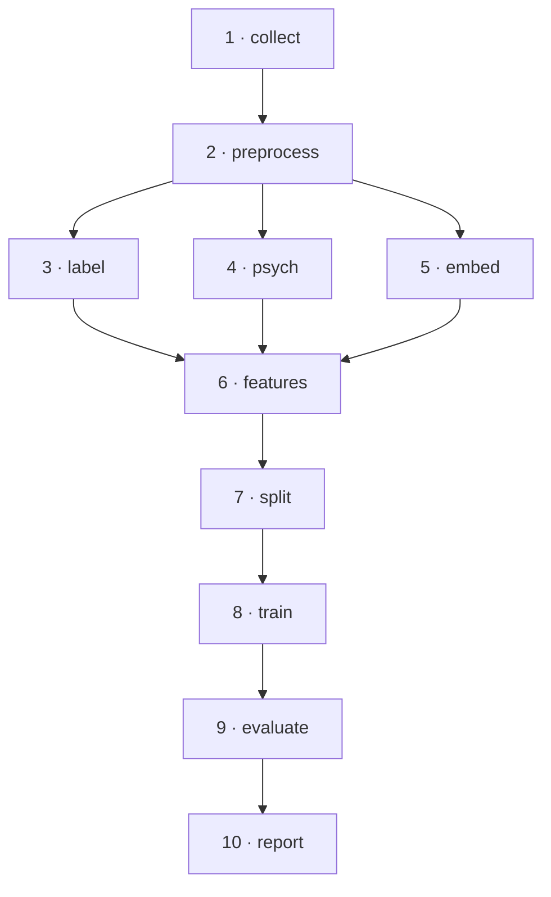

# Uso

## Ponto de entrada

Todas as etapas passam por `src/main.py`:

```bash
python src/main.py --stage <etapa> [opções]
python src/main.py --help
```

O `Makefile` expõe atalhos para cada etapa.

## As dez etapas



| # | Etapa | Comando | Produz |
|---|---|---|---|
| 1 | `collect` | `make collect` | `data/raw/user_histories/*.parquet` |
| 2 | `preprocess` | `make preprocess` | `data/interim/tweets_clean/*.parquet` |
| 3 | `label` | `make label` | `tweets_labeled/*.parquet`, `user_labels.parquet` |
| 4 | `psych` | `make psych` | `psychological_scores.parquet` |
| 5 | `embed` | `make embed` | `data/interim/embeddings/*.npy` |
| 6 | `features` | `make features` | `data/processed/user_features.parquet` |
| 7 | `split` | `make split` | `data/processed/splits.parquet` |
| 8 | `train` | `make train` | `models/artifacts/*.joblib` |
| 9 | `evaluate` | `make evaluate` | `reports/metrics/`, `reports/ablation/` |
| 10 | `report` | `make report` | `reports/figures/`, model card, datasheet |

### Pipeline completo

```bash
make pipeline   # etapas 2 a 10
```

!!! note "Por que a coleta fica de fora"
    `--stage all` **não** inclui a coleta. Ela leva dias, consome contas do
    twscrape e exige aprovação ética — disparar isso por engano numa execução
    completa seria caro em todos os sentidos. Para incluí-la, use
    `make pipeline-full` ou `--stage collect` explicitamente.

## Etapas em detalhe

### 1 · Coleta

```bash
make collect-dry-run   # constrói as consultas sem fazer requisições
make collect           # exige ETHICS_APPROVAL_ID no .env
```

Executa a estratégia da proposta: busca semente por palavras-chave e hashtags,
extração dos autores, coleta retrospectiva do histórico. Grava um Parquet por
usuário, o que torna a coleta **retomável** — interrupções são certas, não
hipotéticas.

Os termos de busca ficam em `configs/queries/*.txt`, versionados: a lista é
parte do método de amostragem e precisa ser auditável.

### 2 · Pré-processamento

Deduplicação, filtros de qualidade, remoção de PII e normalização. Produz **duas**
colunas de texto, e a distinção importa:

- `text_normalized` — PII removida, mas caixa, pontuação e emoji preservados.
  Entrada dos Transformers e do LLM.
- `text_clean` — minúsculas, sem pontuação, sem stopwords, lematizado. Entrada
  do TF-IDF, dos n-grams e dos léxicos.

Aplicar a limpeza agressiva antes do BERTimbau destruiria informação que o
modelo foi pré-treinado para usar.

### 3 · Rotulação

Dois níveis, propositalmente distintos:

- **Tweet** — sentimento por encoder Transformer. É uma *feature*, não um proxy
  de risco clínico.
- **Usuário** — classe por supervisão fraca: voto ponderado entre grupo de
  coleta (0,40), evidência léxica (0,35) e persistência temporal (0,25).

Usuários sem concordância mínima viram `indefinido` e são descartados. Um rótulo
ruidoso corrompe treino **e** avaliação ao mesmo tempo, e nenhuma métrica revela
isso.

A etapa exporta uma amostra estratificada para revisão manual e reporta a
concordância (kappa de Cohen) em `reports/metrics/labeling_quality.json`.

### 4 · Vetor psicológico

```bash
ollama serve    # em outro terminal
make psych
```

Cada lote de tweets do usuário gera um vetor de cinco dimensões: tristeza,
isolamento, esperança, ansiedade e risco suicida. As respostas são validadas com
Pydantic e cacheadas por hash do prompt — reexecutar a etapa é barato.

Para um teste rápido: `python src/main.py --stage psych --limit-users 20`.

### 5 · Embeddings

Separada da construção de features porque é a etapa mais cara em GPU: persistir
os vetores por tweet permite reaproveitá-los em todas as agregações e em todos
os modelos, sem recodificar milhões de textos a cada experimento.

```bash
make embed
python src/main.py --stage embed --all-encoders   # comparação entre encoders
```

### 6 · Atributos

Agrega tudo numa linha por usuário, com os seis grupos. Grupos ausentes (por
exemplo, `psychological` sem a etapa `psych`) são omitidos com aviso.

O relatório `reports/metrics/features_summary.json` traz a contagem de atributos
por grupo e o hash da matriz.

### 7 · Particionamento

Trinta por cento dos usuários vão para validação e teste, estratificados por
classe. Todo tweet de um usuário fica na mesma partição.

!!! danger "Vazamento entre partições"
    Com tweets da mesma pessoa em treino e teste, o modelo aprenderia a
    reconhecer o autor — estilo, vocabulário, temas recorrentes — em vez do
    sinal clínico. A métrica de teste ficaria inflada de um jeito que nenhuma
    inspeção de código revelaria. A verificação é explícita e falha alto.

### 8 · Treinamento

```bash
make train
python src/main.py --stage train --models xgboost hybrid_xgboost
python src/main.py --stage train --include-exploratory
python src/main.py --stage train --skip-cv        # pula a validação cruzada
```

Roda a validação cruzada sobre os folds fixados em `splits.parquet` — os mesmos
blocos para todos os modelos, requisito dos testes pareados — e depois treina no
conjunto de treino completo.

Um modelo que falha não interrompe a comparação: o erro é registrado e os demais
seguem.

### 9 · Avaliação

O conjunto de teste é tocado **uma única vez**, aqui.

Produz métricas com intervalo de confiança, métricas por classe, calibração,
desempenho por fatia, testes de significância (McNemar, Wilcoxon, Friedman),
Ablation Study e análise SHAP.

```bash
make evaluate
python src/main.py --stage evaluate --skip-ablation   # ablação é a parte lenta
```

!!! warning "Não ajuste nada depois de olhar o teste"
    Mudar hiperparâmetro, limiar ou escolha de modelo após ver o resultado do
    teste transforma a métrica reportada em métrica de validação disfarçada, e
    a estimativa de generalização deixa de valer.

### 10 · Relatórios

Gera todas as figuras, o Model Card e o Datasheet.

## Opções da linha de comando

| Opção | Efeito |
|---|---|
| `--stage ETAPA...` | Etapas a executar (`all` = pipeline completo) |
| `--models NOME...` | Restringe a modelos específicos |
| `--include-exploratory` | Inclui a extensão exploratória |
| `--skip-cv` | Pula a validação cruzada |
| `--skip-ablation` | Pula o Ablation Study |
| `--all-encoders` | Gera embeddings com todos os encoders |
| `--limit-users N` | Limita o número de usuários processados |
| `--dry-run` | Constrói as consultas de coleta sem requisições |
| `--continue-on-error` | Prossegue mesmo se uma etapa falhar |
| `--no-tracking` | Desativa o MLflow |
| `--seed N` | Sobrescreve a semente global |
| `--log-level NÍVEL` | Sobrescreve o nível de log |
| `--status` | Mostra a situação dos artefatos e encerra |

## Rastreamento de experimentos

```bash
make mlflow   # http://localhost:5000
```

Cada execução registra a tríade que torna um resultado reproduzível: **código**
(SHA do git), **ambiente** (versões das bibliotecas) e **dados** (hash do
dataset).

## Dashboard

```bash
uv sync --extra app --dev
make app
```

## Interpretando os resultados

`reports/evaluation_report.md` é o ponto de partida. Ao lê-lo:

**Compare com o baseline.** O `dummy` é a referência trivial. Se o modelo
híbrido não o supera por margem confortável, a complexidade não se justificou.

**Leia o intervalo, não o ponto.** Intervalos sobrepostos entre dois modelos
significam que a diferença não está estabelecida, por maior que seja a diferença
das médias.

**Confira o teste de significância.** A tabela ordenada por desempenho não é um
ranking de superioridade comprovada. A seção de testes estatísticos é que diz
quais diferenças são reais.

**Olhe a revocação de `ideacao_suicida`.** É a métrica de maior consequência: um
falso negativo significa deixar de sinalizar alguém potencialmente em risco.

**Verifique as fatias.** Um F1-macro razoável é compatível com desempenho
próximo do aleatório em usuários de histórico curto.

**Leia o Ablation Study nos dois modos.** Contribuição marginal baixa não
significa grupo inútil: grupos correlacionados se substituem mutuamente, e o
modo *only-one* revela isso.
