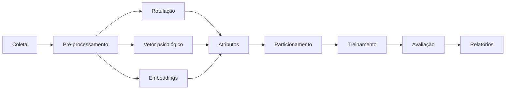

# mental-health-nlp-ptbr

**Detecção longitudinal de sinais de depressão e ideação suicida em redes
sociais com Transformers e Modelos de Linguagem.**

!!! warning "Este sistema não diagnostica"
    O projeto produz um sinal estatístico sobre padrões de linguagem, destinado
    à pesquisa acadêmica. Não substitui avaliação profissional nem deve
    fundamentar decisão automatizada sobre pessoas.

    **Se você está passando por sofrimento psíquico:** no Brasil, o CVV atende
    pelo **188** (24 h, gratuito) e em [cvv.org.br](https://www.cvv.org.br).

---

## O problema de pesquisa

A maior parte dos estudos de detecção automática de depressão e ideação suicida
em redes sociais classifica **publicações isoladas**. Transtornos mentais,
porém, são condições **persistentes**, que se manifestam ao longo do tempo em
padrões comportamentais, emocionais e linguísticos.

Uma única publicação pode não representar o estado psicológico de alguém:
ironia, sarcasmo, letra de música, citação ou reação a um evento pontual
produzem exatamente o mesmo vocabulário que o sofrimento persistente.

Este projeto muda a unidade de análise do **tweet** para o **usuário**.

## Hipóteses

| | Hipótese | Onde é testada |
|---|---|---|
| **H1** | Transformers superam modelos baseados em TF-IDF | Comparação principal |
| **H2** | Atributos temporais e comportamentais melhoram a detecção | Ablation Study |
| **H3** | Atributos psicológicos de LLM aumentam o desempenho | Ablation Study |
| **H4** | Modelos híbridos generalizam melhor | Comparação + ablação |
| **H5** | Modelagem por usuário supera classificação por tweet | Comparação de granularidade |

## O pipeline

Cada etapa lê artefatos do disco e grava outros. O acoplamento é o sistema de
arquivos, não a memória — o que permite executar uma etapa isolada, retomar uma
execução interrompida e inspecionar qualquer resultado intermediário. Num
projeto em que a coleta leva dias e o fine-tuning leva horas, isso é o que torna
a iteração viável.

## Por onde começar

- :material-download: **[Setup](guides/setup.md)** — instalação, dependências opcionais e configuração dos segredos
- :material-play: **[Uso](guides/usage.md)** — execução do pipeline, etapa a etapa
- :material-sitemap: **[Arquitetura](guides/architecture.md)** — decisões de projeto e suas justificativas
- :material-shield-account: **[Ética e LGPD](guides/ethics.md)** — salvaguardas, base legal e limitações
- :material-api: **[Referência da API](reference.md)** — gerada das docstrings

## Princípios do projeto

**Falhar cedo e alto.** Configuração inválida derruba a execução no *startup*,
não no meio de um treinamento de horas. Contratos `pandera` validam a fronteira
entre estágios, para que corrupção silenciosa não se propague.

**Nenhum número solto.** Toda métrica principal vem com intervalo de confiança;
toda afirmação de superioridade vem com teste de significância e tamanho de
efeito.

**Privacidade por construção.** Identificadores diretos são pseudonimizados
antes de tocar o disco; PII é removida do texto e filtrada nos logs; o
processamento por LLM é local.

**Limitações declaradas.** O rótulo `controle` significa *sem sinais detectados
no recorte coletado*, e não ausência clínica. Os rótulos vêm de supervisão fraca
e sua qualidade delimita o teto de desempenho. Nada disso é rodapé — está no
model card e no datasheet.
